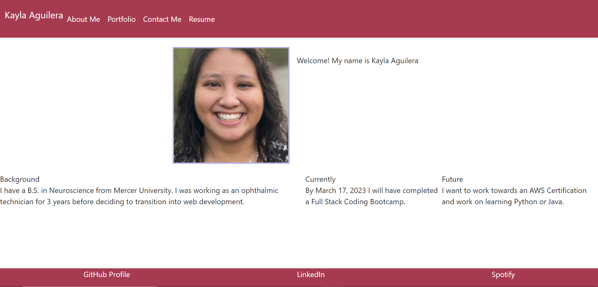

# Fridge Projects

## Errors

Due to problems with deploying with GitHub pages, please see repository <a href="https://github.com/kaguilera23/fridge-projects">Fridge Projects</a> for full commit history

## Description

This is the place for you to nicely display to your future employers/clients all of your projects that are worthy of being hung on the family fridge! You can also include sections to "About Me", "Contact Me", and "Resume" pages.

## Installation

N/A

## Usage

When you first load the portfolio, you will be taken to the "About Me" section. However, clicking on any of the links in the navigation bar will load that specific page. There are also links to GitHub, LinkedIn, and Spotify at the bottom of the page.

## Link

Visit the Portfolio <a href="https://kaguilera23.github.io/fridge-projects/">Here!</a>
